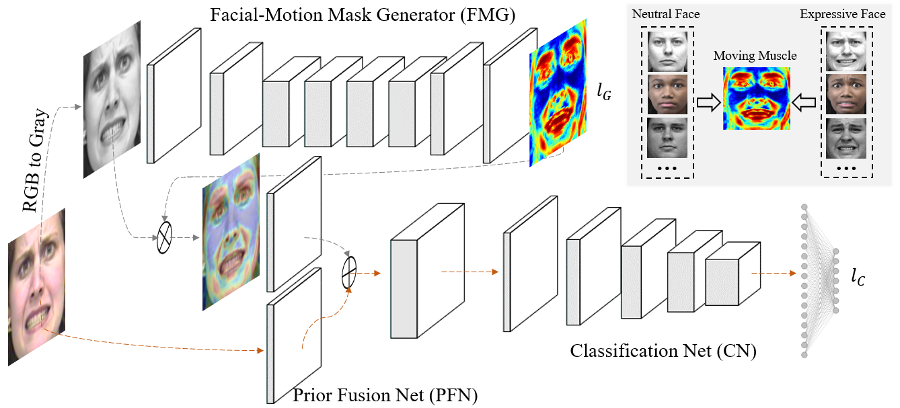

# FMPN-FER

<p align="left">
	
	
	
	
</p>

[](https://paperswithcode.com/sota/facial-expression-recognition-on-mmi?p=facial-motion-prior-networks-for-facial)

[](https://paperswithcode.com/sota/facial-expression-recognition-on-ck?p=facial-motion-prior-networks-for-facial)

Official PyTorch Implementation of **Facial Motion Prior Networks for Facial Expression Recognition** by <a href="https://donydchen.github.io">Yuedong Chen</a>, <a href="https://jianfeng1991.github.io/personal">Jianfeng Wang, <a href="https://www.researchgate.net/profile/Shikai_Chen3">Shikai Chen</a>, Zhongchao Shi, and <a href="https://www.ntu.edu.sg/home/asjfcai/">Jianfei Cai</a>. 
<br>VCIP 2019, Oral, \[[arXiv](https://arxiv.org/abs/1902.08788)\]



## Setup

#### To get this project up and running you should start by having Python installed on your computer. It's advised you create a virtual environment to store your projects dependencies separately. You can install virtualenv with

``` sh
pip install virtualenv
```

#### Clone or download this repository and open it in your editor of choice. In a terminal (mac/linux) or windows terminal, run the following command in the base directory of this project

``` sh
virtualenv env
```

#### Check and set ExecutionPolicy on Windows follow this tutorial:
``` sh
1. Open VSCode as Adminstrator
2. Open Terminal
3. Type <powershell>
4. Type <Get-ExecutionPolicy>. If it return Restricted, continue to next step
5. Type <Set-ExecutionPolicy –ExecutionPolicy RemoteSigned>
6. Check again by type <Get-ExecutionPolicy>
7. Close VSCode and open normal again.
```

#### That will create a new folder env in your project directory. Next activate it with this command on Windows:

``` sh
1. env\Scripts\activate
2. or: e:/THESIS/GITHUB/PreProduceCode-FMPN-FER/env/Scripts/Activate.ps1
```
or Mac/Linux:
``` sh
source env/bin/active
```

#### Deactivate it with this command on Windows:

``` sh
deactivate
```

#### Then install the project dependencies with

``` sh
pip install -r requirements.txt
```

#### Now you can run the project with this command

``` sh
python manage.py runserver
```

**Note** if you want payments to work you will need to enter your own Stripe API keys into the `.env` file in the settings files.

---

### Prerequisites

* python >= 3.6
* pytorch >= 0.4.1
* visdom == 0.1.8.9

### Check CUDA

``` sh
nvcc --version
nvidia-smi
```

### Add tunnel to run visdom in colab

``` sh
1. pip install nest_asyncio, pyngrok
2. open 2 terminal :
      2.1 python -m visdom.server -port 8097
      2.2 python tunnel.py
3. In line 32 of visualizer.py
      3.1 copy/paste the link from step 2.2 to server= "<link>"
      3.2 change port to 80
```

### Training

The training phase mainly contains two stages, including training the generator for generating facial motion mask, and jointly training the whole recognition network. Running scripts examples are given as below. 

#### Pretrain the Facial-Motion Mask Generator (FMG)

``` sh
python main.py --mode train --data_root datasets/CKPlus --train_csv train_ids_8.csv \
    --print_losses_freq 4 --use_data_augment --visdom_env main \
    --niter 50 --niter_decay 50 --gpu_ids 0 --batch_size 16 \
    --model res_baseline --solver resface --img_nc 1 \
    --visdom_port 80 --visdom_ip http://6f46-2405-4800-52a7-232f-ed31-dec5-a662-7c6d.ngrok.io \
    /
```

#### Jointly Train the Facial-Motion Prior Network

Load the saved weight for the FMG pertained in the previous stage, and ImageNet pretrained weight for the Classifer Net.

```sh
python main.py --mode train --data_root datasets/CKPlus --train_csv train_ids_8.csv \
    --print_losses_freq 4 --use_data_augment --visdom_env res_cls_ckp_0 --niter 50 \
    --niter_decay 50 --gpu_ids 0 --model res_cls --solver res_cls --lambda_resface 0.1 \
    --batch_size 16 --backend_pretrain \
    --load_model_dir ckpts/CKPlus/res_baseline/fold_8/211024_033139 --load_epoch 100 \
    --visdom_port 80 --visdom_ip http://6f46-2405-4800-52a7-232f-ed31-dec5-a662-7c6d.ngrok.io \
    /
```

### Testing 

``` sh
python main.py --mode test --data_root datasets/CKPlus --test_csv test_ids_1.csv \
    --gpu_ids 0 --model res_cls --solver res_cls --batch_size 2 \
    --load_model_dir ckpts/CKPlus/res_cls/fold_8/211026_072450 --load_epoch 100 \
    --visdom_port 80 --visdom_ip http://6f46-2405-4800-52a7-232f-ed31-dec5-a662-7c6d.ngrok.io \
    /
```
### Testing in VS Code need to change number of worker to 1 to decrease less RAM for run test.

``` sh 
Watch explain here: https://github.com/ultralytics/yolov3/issues/1643#issuecomment-755254615
```

``` sh
python main.py --mode test --data_root datasets/CKPlus --test_csv test_ids_1.csv \
    --gpu_ids 0 --n_threads 1 --model res_cls --solver res_cls --batch_size 2 \
    --load_model_dir ckpts/CKPlus/res_cls/fold_8/211026_072450 --load_epoch 100 \
    --visdom_port 80 --visdom_ip http://6f46-2405-4800-52a7-232f-ed31-dec5-a662-7c6d.ngrok.io \
    /
```

## Datasets

* The pseudo ground truth facial motion masks for dataset CK+, MMI and AffectNet are presented in `/datasets`.
* Training and Testing datasets splits are located in `/datasets`, 10-fold cross validation is used in the project as a general approach.

## Citation - References

If you use this code for your research, please cite our paper <a href="https://arxiv.org/abs/1902.08788">Facial Motion Prior Networks for Facial Expression Recognition</a>:

```
@article{chen2019facial,
  title={Facial Motion Prior Networks for Facial Expression Recognition},
  author={Chen, Yuedong, Jianfeng Wang, Shikai Chen, Zhongchao Shi, and Jianfei Cai},
  journal={IEEE Visual Communications and Image Processing (VCIP)},
  year={2019},
  organization={IEEE}
}
```
